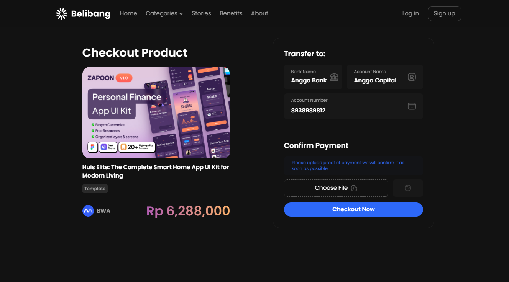
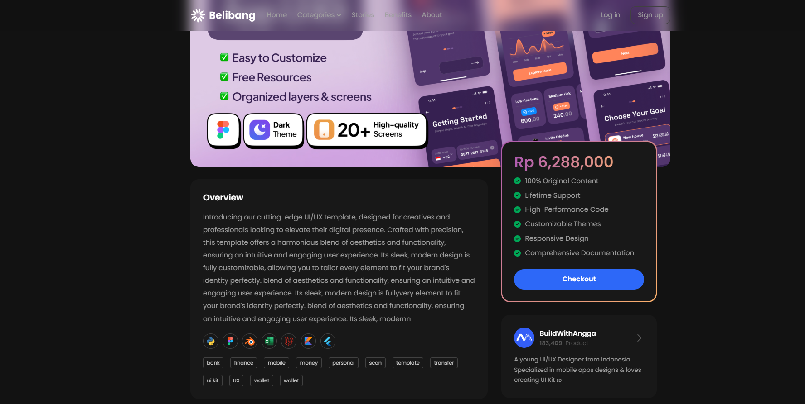

# UI Template dengan HTML

Repository ini berisi tampilan **User Interface (UI)** yang dibuat menggunakan **HTML**, beserta dukungan CSS dan JavaScript (jika diperlukan). Proyek ini dibuat sebagai contoh/template untuk memulai pembuatan tampilan web yang responsif dan modern.



## Fitur

- **Struktur HTML5**: Menggunakan elemen HTML semantik untuk kemudahan pengembangan dan SEO.
- **Desain Responsif**: Tampilan menyesuaikan dengan berbagai ukuran layar.
- **Mudah Dikustomisasi**: File terpisah untuk HTML, CSS, dan JavaScript memudahkan pengembangan lebih lanjut.
- **Integrasi CSS dan JS**: Dukungan penuh untuk styling dan interaktivitas (opsional).

## Pratinjau (Preview)





## Teknologi yang Digunakan

- [HTML5](https://developer.mozilla.org/en-US/docs/Web/HTML)
- [CSS3](https://developer.mozilla.org/en-US/docs/Web/CSS)
- [JavaScript](https://developer.mozilla.org/en-US/docs/Web/JavaScript)

## Cara Memulai

### Prasyarat

Pastikan kamu sudah menginstall:
- Web Browser modern (Chrome, Firefox, Edge, dll.)
- Text Editor atau IDE (VSCode, Sublime Text, dll.) *(opsional untuk pengembangan)*

### Langkah-langkah

1. **Clone Repository**  
   Buka terminal atau command prompt, lalu jalankan perintah berikut:
   ```bash
   git clone https://github.com/maulana-tech/marketBang-SGS-HIMASIA.git

2. **Masuk ke Directory**  
   Buka terminal atau command prompt, lalu jalankan perintah berikut:
   ```bash
   cd belibang-html
